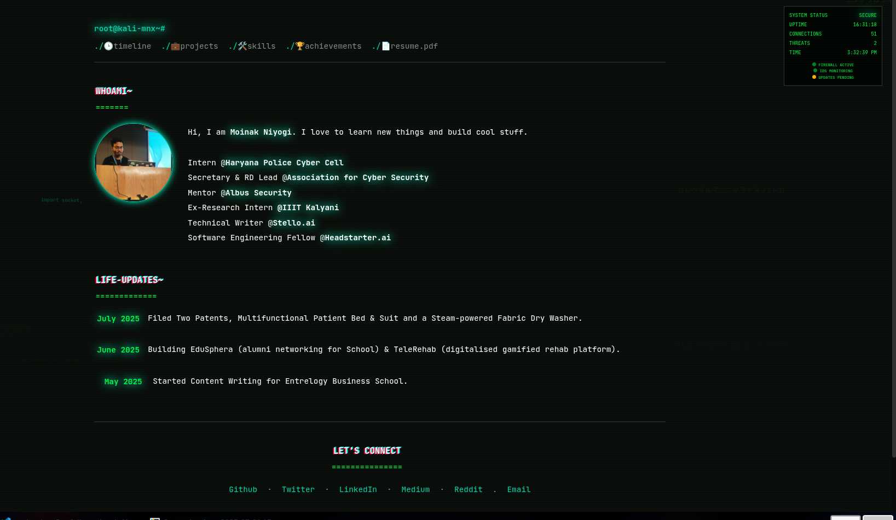

<h1 align="center">🧠 🔍 Root@kali-mnx:~/DevJourney 🚀</h1>

<p align="center">
  
  
  
</p>

## 📸 Preview

<p align="center">
  
</p>


> ⚡️ Terminal-themed, developer-centric, ultra-modern personal portfolio built with React + Tailwind.  
> Designed to **impress**, **perform**, and **stand out**.

---

## 📂 Project Overview

Welcome to my developer terminal — not your regular portfolio.  
Inspired by the hacker aesthetic, this portfolio is a blend of clean UI, component-driven architecture, and interactive storytelling.

- 💻 Built with **React.js** + **TailwindCSS**
- 🧱 Modular folder structure
- 🖥️ Developer-first terminal interface
- 🎯 Responsive, minimal, and aesthetic

---

## 📌 Key Features

- ✅ **Timeline View** – Track my dev journey from first lines of code to latest achievements
- ✅ **Life Updates** – Real-time accomplishments, certifications & highlights
- ✅ **Minimal Terminal UI** – Styled like a coding terminal
- ✅ **Fully Responsive** – Looks sharp on mobile, tablet, and desktop
- ✅ **Super Clean Codebase** – For contributors and curious minds alike

---

## ⚙️ Tech Stack

| Technology  | Usage           |
|-------------|------------------|
| ⚛️ React.js | Frontend Framework |
| 🎨 TailwindCSS | Styling & Responsiveness |
| 📦 Vite     | Build Tool & Dev Server |
| 🧾 Markdown | For this insane `README.md` |
| 🧠 Git/GitHub | Version Control & Hosting |

---

## 🏗 Folder Structure

```
my-portfolio/
├── public/
│   └── assets/           # Icons, images, etc.
├── src/
│   ├── components/       # Timeline, LifeUpdates, TerminalPrompt, etc.
│   ├── styles/           # Custom CSS (if any)
│   ├── App.jsx           # App entry component
│   └── main.jsx          # ReactDOM rendering
├── tailwind.config.js
├── postcss.config.js
├── package.json
└── README.md
```

---

## 🚀 Getting Started

```bash
# 1. Clone the repo
git clone https://github.com/Cyberninja30/Portfolio-mnx.git

# 2. Navigate into the directory
cd my-portfolio

# 3. Install dependencies
npm install

# 4. Run the dev server
npm run dev
```

> 🔗 Visit: `moinakone.vercel.app` in your browser

---

## 📡 Deployment

Easily deploy on any modern platform:

- ⚙️ **Vercel**

```bash
npm run build
# Deploy the /dist folder using your preferred method
```

---

## 🧠 Author

**Moinak Niyogi**  
Cybersecurity Enthusiast | Open Source Contributor | Technical Writer

- 🐙 [GitHub](https://github.com/Cyberninja30)
- 👔 [LinkedIn](https://www.linkedin.com/in/moinak-niyogi/)
- 🌐 [Portfolio (Live)](https://your-portfolio-link.com) <!-- Replace with actual link -->

---

## 🪪 License

This project is released under the **MIT License**.  
Feel free to fork, star ⭐, and build your own version.

---

> ✨ _“Stay curious. Stay weird. Keep building.”_
```
